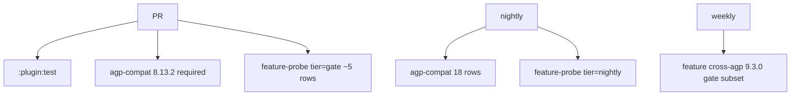

# Feature probe 设计

English companion: this doc defines the **feature matrix**, orthogonal to [AGP compatibility probe](COMPATIBILITY.md).

## 两个矩阵的分工

| | AGP compat (`agp-compat.sh`) | Feature probe (`feature-probe.sh`) |
|--|------------------------------|-------------------------------------|
| **变量** | AGP / Gradle 版本（18 档） | `molt {}` 功能 / 配置 preset |
| **固定** | 最小 fixture 配置 | 固定 AGP（默认 **8.13.2 / Gradle 8.13**） |
| **回答** | 这个 AGP 能不能跑通？ | 这个功能在代表 AGP 上能不能跑通？ |
| **成本** | 高（90 runs） | 中（~15–20 runs × 1 AGP） |

两者 **不重复**：AGP 矩阵用 `default` preset；Feature 矩阵用 **固定 AGP** 扫 **未在 AGP 矩阵里打开的配置**。

## 探针类型（probe）

与 AGP 矩阵相同的 5 类，但每行只跑 **一种或一组**：

| probe | Gradle 任务 | 适用功能 |
|-------|-------------|----------|
| `smoke` | prepare / resources / junk-keep / crashlytics assert | 编译期：overlay、junk、keep、接线 |
| `apk` | `assembleGoogleRelease` | APK transform（rename 关） |
| `aab` | `bundleGoogleRelease` | AAB transform（rename 关） |
| `apk-rename` | `assembleGoogleRelease` | APK + component/view rename + merge mapping |
| `aab-rename` | `bundleGoogleRelease` | AAB + rename + merge mapping |
| `all` | 以上 5 探针 | 仅 `F00-baseline` 对照 |
| `sample` | `moltObfuscateSampleAssemble` | 真实 sample 工程（无 TestKit） |
| `integration` | `moltObfuscateIntegrationPrepare` | 宿主工程 assemble/bundle（需 `MOLT_INTEGRATION_ROOT`） |

一行可声明 **单个 probe**、**`all`**（5 探针，仅 `F00-baseline`），或 **`sample`/`integration`**（weekly，缺目录 SKIP）。

## Preset 设计

Preset = 在 `AgpTestFixture.writeFixture` 之上的 **声明式覆盖**（`FeatureProbeProfiles.apply(preset, root)`）。

| preset | 相对 default 打开/变更 | 验证点 |
|--------|------------------------|--------|
| `default` | 与当前 agp-compat fixture 相同 | 对照基线 |
| `overlay-rename` | `renameXmlFiles=true`, `injectXmlJunk=true`, library `keep.xml` | overlay 重命名 + autoDiscover |
| `overlay-images` | `imageAntiDetect=true`, `imageJpegMicroCompress=true`, 测试 png/jpeg res | 图片 metadata / 微压缩 |
| `overlay-noise` | `imagePerceptualNoise=true` |  perceptual noise 路径 |
| `junk-activity` | `profile=heavy`, `activityCountPerPackage=1`, `mergeJunkManifest=true` | Activity junk + Manifest 合并 |
| `arsc-dir` | `obfuscationMode=dir`, apk transform on | arsc dir 模式 |
| `arsc-file` | `obfuscationMode=file`, apk transform on | arsc file 模式 |
| `keep-verify` | `verifyApkKeep=true`, `verifyBundleKeep=true`, app+library `keep.xml` | keep 验包 |
| `baseline-sync` | `syncBaselineProfile=true`, 提供 `baseline-prof.txt`, rename on | baseline profile 重编 |
| `variant-config` | `variantConfig { googleRelease { junk heavy; verify on } }` | variant 级覆盖 |
| `shrink-keep` | `mergeShrinkKeepXml=true`, fixture 注册 mock `generateShrinkKeepXml*` | shrink keep 合并 |
| `rename-full` | rename 全开（同 apk-rename/aab-rename 探针） | DEX + layout + mapping |

## 功能矩阵（`tools/feature-probe-matrix.txt`）

固定 **AGP 8.13.2 / Gradle 8.13**，除非行内另指定。

### Tier 说明

| tier | CI | 说明 |
|------|-----|------|
| `gate` | PR 必过 | 核心功能，约 5 行 |
| `nightly` | nightly job | 全功能 preset |
| `cross-agp` | release/weekly | 在 **9.3.0 / 9.5** 上复跑 gate 子集 |
| `weekly` | weekly job | sample / 宿主 integration smoke（缺目录时 SKIP） |

### 与现有测试的关系

| 已有 | Feature probe 关系 |
|------|-------------------|
| `AgpCompatibilityTest` | AGP 维度；feature 不替代 |
| ~~`MoltObfuscatePluginFunctionalTest`~~ | **已删除**；overlap 用例迁入 preset + 矩阵行（F00/F01/F05/F06/F09） |
| `:plugin:test` 单元测试 | 纯逻辑；feature probe 不替代 |
| `dexComponentRenameIntegrationTest` | 真实 APK；保留 nightly，不进 TestKit 矩阵 |
| `moltObfuscateSampleAssemble` | 矩阵行 **F99-sample**（weekly；无 sample 目录时 SKIP） |
| `moltObfuscateIntegrationPrepare` | 矩阵行 **F98-integration**（weekly；无 `MOLT_INTEGRATION_ROOT` 时 SKIP） |

## 每行断言（除 task SUCCESS 外）

| feature_id | 额外断言 |
|------------|----------|
| F01-overlay-rename | generated res 中 `google.xml` 被 rename；`base.xml` 因 keep 保留 |
| F02-overlay-images | overlay 日志 / 图片 hash 变化 |
| F04-junk-activity | merged manifest 含 junk Activity；DEX 含 junk 类 |
| F07/F08 arsc-* | `resources-mapping.txt` 非空；mode 特定 entry |
| F11-keep-verify | 验包 task 无 fail；关键 `@layout/` 仍在 APK |
| F13-baseline-sync | `baseline.profm` 产物更新 |
| F14-variant-config | googleRelease 使用 heavy junk 规模 |

## 运行方式

```bash
# 全矩阵（默认 AGP 8.13.2）
./tools/feature-probe.sh

# 单行
MOLT_FEATURE_PROBE=F01-overlay-rename ./tools/feature-probe.sh

# gate / nightly / cross-agp tier
FEATURE_PROBE_TIER=gate ./tools/feature-probe.sh
FEATURE_PROBE_TIER=nightly ./tools/feature-probe.sh
FEATURE_PROBE_TIER=cross-agp ./tools/feature-probe.sh

# 指定 AGP 跑 gate 子集（覆盖矩阵 AGP 列；须同时设 AGP + Gradle）
MOLT_FEATURE_AGP=8.0.2 MOLT_FEATURE_GRADLE=8.0 FEATURE_PROBE_TIER=gate ./tools/feature-probe.sh

# 单行 @ AGP 8.0
MOLT_FEATURE_PROBE=F01-overlay-rename MOLT_FEATURE_AGP=8.0.2 MOLT_FEATURE_GRADLE=8.0 ./tools/feature-probe.sh
```

Gradle 任务：

```bash
./gradlew :plugin:moltObfuscateFeatureProbeTest -PmoltFeature=F01-overlay-rename --no-daemon
./gradlew :plugin:moltObfuscateFeatureProbeMatrix   # 跑 tools/feature-probe.sh
```

环境变量：

| 变量 | 含义 |
|------|------|
| `MOLT_FEATURE_PROBE` | 矩阵行 `feature_id` |
| `MOLT_FEATURE_PRESET` | 直接指定 preset（调试） |
| `MOLT_FEATURE_AGP` / `MOLT_FEATURE_GRADLE` | 覆盖矩阵 AGP/Gradle（须同时设置；如 `8.0.2` / `8.0`） |
| `MOLT_TEST_AGP` / `MOLT_TEST_GRADLE` | 同上（别名，与 agp-compat 一致） |
| `FEATURE_PROBE_TIER` | `gate` / `nightly` / `cross-agp` / `weekly` / `all` |

## CI 分层建议



| Job | 预估耗时 | Runs |
|-----|----------|------|
| feature gate | ~15–25 min | 5 presets × 1 probe each |
| feature nightly | ~45–60 min | ~15 rows × 1 probe |
| cross-agp | ~10 min | 3 rows × 9.3.0 |

## 实现阶段

### Phase 1（文档 + 矩阵）✅

- [x] `docs/FEATURE_PROBE.md`
- [x] `tools/feature-probe-matrix.txt`

### Phase 2（TestKit preset 层）✅

- [x] `FeatureProbeProfiles.kt` — preset → `app/build.gradle` / res / manifest 补丁
- [x] `FeatureProbeTest.kt` — 读 `MOLT_FEATURE_PROBE`，选 preset + probe，跑断言
- [x] `moltObfuscateFeatureProbeTest` in `plugin/build.gradle.kts`

### Phase 3（Runner + CI）✅

- [x] `tools/feature-probe.sh` — 报告 `build/reports/feature-probe/report.md`
- [x] `.github/workflows/feature-probe.yml` — gate + nightly + cross-agp

### Phase 4（迁移 + weekly 增强）✅

- [x] 删除 `MoltObfuscatePluginFunctionalTest`；overlap 断言迁入 `FeatureProbeAssertions`（F00/F01 等）
- [x] `moltObfuscateTransform*E2eTest` 改为 feature probe 别名（F05/F06/F09）
- [x] **F99-sample** / **F98-integration** 矩阵行 + `sample`/`integration` probe 类型
- [x] weekly CI job；`moltObfuscateNightlyVerify` 改用 `moltObfuscateFeatureProbeNightly`

## 不在 feature 矩阵内的内容

- 所有 AGP 版本组合 → **agp-compat**
- Parser/算法纯单测 → **:plugin:test**
- 真实大 APK DEX 改写 → **dex integration / nightly**
- 每个 `failOn*` 组合爆炸 → 单测 + 1 行 representational e2e 即可
